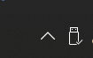

# URLAutoOpener

Open an URL when your network is disconnected, school network auto login, 断网自动打开链接, 校园网自动登录

This is an repo modified from [my another repo](https://github.com/Alyvesy/USYNetAutoLogin). But this is a universal version.

## Requirement

- .NET framework 4.7.2
- Windows Form Dev Tool

## Settings

1. You could change settings in [config.txt](bin\Debug\config.txt) (bin\Debug\config.txt)

```
App Name=  // Your app name in notify
URL=  // URL you want to open
Detection Interval=  // Detect interval (Recommand higher than 500)
Detection Region=  // Standard: 0 ; For Chinese users: 1 ; This will change the websites for detect. If you want to change the url for detection go into Form1.cs
```
And you can also change the icon in notify
- icon_connected.ico: icon when network connected
- icon_disconnected.ico: icon when network didn't connect

#### Another way to change settings
1. Go into Form1.cs
2. In Form1 class

```csharp
// Property Settings
private string appName = "URLAutoOpener";  // App name in notify
private string url = "https://github.com/Alyvesy";  // URL you want to open
private int checkInterval = 2000;  // Detect delay (Recommand higher than 500)
// You can change which websites for detection
private List<string> detecterSite = new List<string> { "https://208.67.222.222", "https://1.1.1.1", "https://8.8.8.8" };
private List<string> detecterSiteCN = new List<string> { "http://www.baidu.com", "https://ping.chinaz.com", "https://8.8.8.8" };
```

## Usage

- There won't be any window display when u run this app
- You can find app in the notification area on the taskbar

    

- Right click the icon to open menu